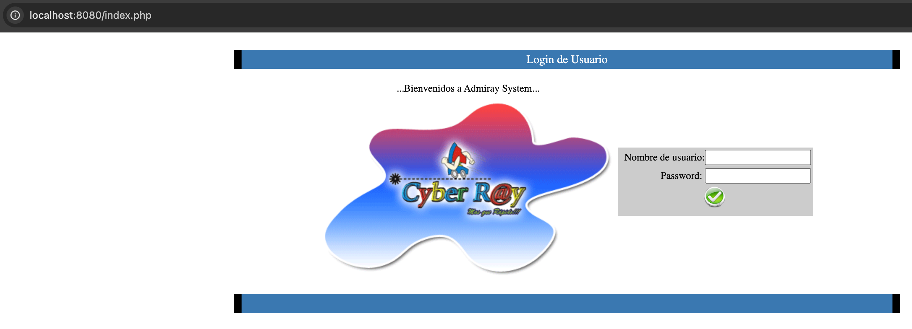
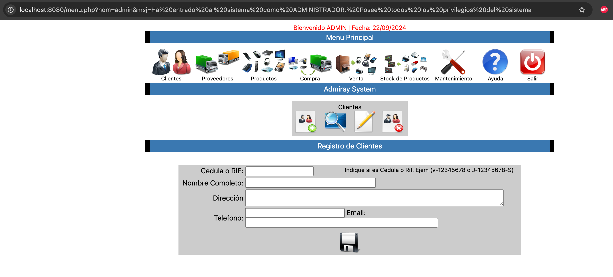

# Admiray

## Instalación

### Requerimientos

- Docker
- Ubicarse en la ruta raiz del proyecto

### Pasos

- Una vez instalado docker iniciar contenedores de BD y PHP, para esto ejecutar el comando

  - > docker-compose up -d
    >
- Al ejecutarlo debe visualizar 2 contenedores con los nombre **admiray-app** y **admiray-db**
- Copiar respaldo de BD con el comando

  - > docker cp db/Admiray_TablesAndInitialData.sql admiray-db:/Admiray_TablesAndInitialData.sql
    >
- Ingresar al contenedor para restaurar la BD

  - > docker exec -it admiray-db bash
    >
- Restaurar datos, al ejecutarlo solicitará una contraseña, ingresar *root*

  - > mysql -u root -p admiray < /Admiray_TablesAndInitialData.sql
    >
- Luego de esto puede confirmar la creación de DB y tablas con cualquier cliente MySQL como DBeaver o MySQL Workbench
- Ingresar a la ruta [localhost:8080](http://localhost:8080/), puede ingresar con los datos de usuario precargados. Usuario *admin* y contraseña *1234*
  

  Ya dentro del sistema visualizará algo similar a la siguiente imagen, dependiendo del módulo cambia la vista

  
****